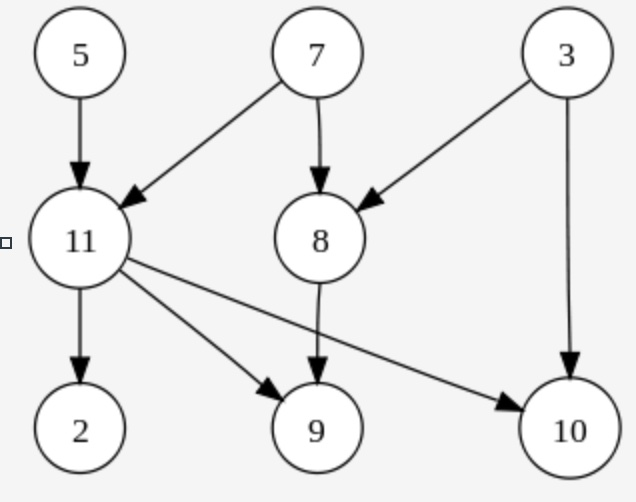

[](https://classroom.github.com/a/M4bLV4Jl)
# Lab08

# 💥 Clone this repo
Before starting the project: **Clone the repo** to your local machine:  
   - Copy the repo link (green "Code" button).
   - **Navigate to the folder**: `cd CS5008` and then `mkdir Lab *"`, then `cd "Lab *"`, then run
     ```bash
     git clone <link>  
     ```  

As you continue working on the project:
1. **Make changes** in your local files.
2. **Stage** those changes with `git add <file-name>`  or `git add`.
3. **Commit** the changes with `git commit -m "message"`.
4. **Push** the changes back to GitHub with `git push`.

-------------------------------------------------------
# 💥 Graph Representation and Topological Sorting with Adjacency Matrices

This lab is designed to deepen your understanding of graph representations, particularly through adjacency matrices. You will learn how adjacency matrices can be used to represent directed graphs, which is a crucial foundation for various graph algorithms.

You’ll also explore topological sorting, a process used to order the nodes of a directed acyclic graph (DAG) based on their dependencies. As you work with adjacency matrices, you will see how the graph’s structure directly influences the sorting process.

Finally, through analytical exercises, you will have the opportunity to solidify your grasp of graph-related concepts, including adjacency matrices, topological sorting, and their applications.

-------------------------------------------------------

# 💥 Part 1: Adjacency Matrix Representation

💫 Task 1.💫 Obtain the code skeleton provided in the adjacencymatrix.c to serve as the foundation for this lab.​

When working with graphs, the first thing we need is to utilize a data structure that can store our graphs node and edge relationships  One way to do to this is to by using something called an [adjacency matrix](https://en.wikipedia.org/wiki/Adjacency_matrix)

### 💥 adjacency matrix

Adjacency Matrix is a 2D array used to represent a graph, where each element indicates the presence (or absence) of an edge between vertices. For a graph with $𝑛$ vertices, the adjacency matrix will have dimensions $n \times n$. A value of '1' at position [i][j] signifies an edge from vertex $i$ to vertex $j$; a '0' indicates no such edge.​

Example Adjacency Matrix:

|     | 0 | 1 | 2 | 3 | 4 |
|-----|---|---|---|---|---|
| **0** | 0 | 0 | 1 | 1 | 1 |
| **1** | 1 | 0 | 0 | 1 | 1 |
| **2** | 0 | 1 | 0 | 1 | 1 |
| **3** | 1 | 0 | 0 | 0 | 0 |
| **4** | 1 | 0 | 1 | 1 | 0 |

In this matrix:

   - Vertex 0 has edges to vertices 2, 3, and 4.​

   - Vertex 1 has edges to vertices 0, 3, and 4.​

### 💥 Multi-dimensional array (2D arrays):
In order to create an adjacency matrix. we need to allocate a multi-dimensional array in C. We will create an array with 2 dimensions in this lab.

In the `adjacencymatrix.c` file, you will find the following.
```
#define ROWS 5
#define COLUMNS 5

int g_testgraph[ROWS][COLUMNS];
```

In the above example, we create a multidimensional array of integers named `g_testgraph`. There are 5 rows and 5 columns, thus our array can hold 25 (5 ROWS * 5 COLUMNS) integers.

### 💥 Accessing data in the adjacency matrix inside one function
Working with multidimensional arrays can be a little tricky. Remember when we create an array, it is just a contiguous block of memory (regardless if it is 1D, 2D. 3D, etc.).

Often, however, it is convenient to think about picking out a row and a column (i.e., visualizing the grid of 5x5 integers). Shown below is our array of 25 integers, which are laid out in memory as follows:

```
// This indeed looks like a 1-D array, but we want to think about
// accessing the i-th row and j-th column
|0|1|2|3|4|5|6|7|8|9|10|11|12|13|14|15|16|17|18|19|20|21|22|23|24|
```
Again, so even if I create an array `g_testgraph[5][5]`, it will have the memory layout above.

So if I rearrange memory in a 2D grid to more conveniently visualize it, I get the following visualization.

```
// Ah, this is much better
// Now this is more useful when thinking about a graph
0  1  2  3  4
5  6  7  8  9
10 11 12 13 14
15 16 17 18 19
20 21 22 23 24
```
   * Hmm, now we want to access the item '1' in my above grid I do so by accessing the 0th row and the 1st column: `g_testgraph[0][1]`
   * Now if I want to access '16', I do so by accessing the third and the 1st column: `g_testgraph[3][1]`
   * But these techniques won't necessarily work when we are passing our static arrays around to functions...

### 💥  C and multi-dimensional arrays in functions
A functionality we will want is to pass our graphs around in functions. Now, C can be a little weird, meaning doing some things you might not expect when it comes to passing multi-dimensional arrays to functions as parameters. This is because we somehow need to specify the size of our array to our function (e.g., like when we create a queue or stack and specify the capacity). Unfortunately, in most C compilers we typically can only pass along a pointer to our array. This means we need to do a little bit of arithmetic to figure out where in memory we are.

The following code is an example of 'offsetting' to the correct position within an array. You will notice there is some arithmetic in our array to access the appropriate row and column `g[i*COLUMNS+j]`:

```
// This function will print out the adjacency
// matrix for a graph 'g'.
void printGraph(int* g){ 
    int i, j;
    for(i = 0; i < ROWS; i++){
        for(j = 0; j < COLUMNS; j++){
            printf("%d ", g[i * COLUMNS + j]);
        }
        printf("\n");
    }
}
```
   * In order to access a column, we multiply by `i*COLUMNS` which is selecting the row (e.g. multiplying when i = 0 puts us in the 0th row). Then we move along the column (the `+j` part) when we are in the correct row. When passing a 2D array to a function in C, it's treated as a pointer. Access elements using offset calculations, such as `g[i * COLUMNS + j]`.
     
Take a little bit of time to try to understand what is going on here and convince yourself this will print the graph. Use your group to make sure you understand by verbally explaining how this works to each other!


💫 Task 2.💫 Practice retrieving some graph data:
Okay, now that you understand the data structure, you will implement three (3) functions to practice retrieving some graph data:

   1. Implement `nodeInDegree(int* g, int node`: Calculate the in-degree of a given node.​

  2. Implement `nodeOutDegree(int* g, int node)`: Calculate the out-degree of a given node.​

   3. Implement `isConnected(int* g, int node1, int node2)`: Determine if there's a direct edge from node1 to node2.​


💫 Task 3.💫 (optional) Dynamically Allocate the Adjacency Matrix :

To make all of those nasty warnings in your code go away, you should dynamically allocate your matrix in the code: replace the static allocation with a dynamic allocation for your 2D matrix. 

Read [this resource](https://www.geeksforgeeks.org/dynamically-allocate-2d-array-c)  and choose one of the methods for dynamically allocating a 2D array that is different from what we used in `adjacencymatrix.c`. Make sure you understand how to implement it, and why it's necessary - you'll answer in the written section. 

------------------------------------
# 💥 Part 2: Topological Sort

In this part, you will get to learn about topological sort by using a tool called [tsort](https://man7.org/linux/man-pages/man1/tsort.1.html) which can perform a topological sorting of data. Note that you must be ssh'd into the servers to use tsort. We are going to start by providing a video that explains the topological sorting algorithm:

https://northeastern.hosted.panopto.com/Panopto/Pages/Viewer.aspx?id=86cf3cd9-bd84-4c51-a311-ad67012caf67&start=3.966105

Topological sorting orders the vertices of a Directed Acyclic Graph (DAG) such that for every directed edge 
`uv`, vertex `u` comes before `v` in the ordering. The `tsort` utility in Unix/Linux performs this operation.​


Example 1: Given the following graph [Directed Acyclic Graph (DAG)](https://en.wikipedia.org/wiki/Directed_acyclic_graph)



💫 Task 3.💫
Make a text file "topo1.txt" and modify it to show the relationships in the following graph and output a topologically sorted ordering.


[]()
  As an example, 3 connected with 8 will be represented as follows in a line on the file.

```
3 8
```
When you have entered the graph, then run tsort using the following command:

```
tsort topo1.txt
```
Note: Ensure that the input data represents a DAG. If the graph contains cycles, tsort will report an error indicating the presence of a loop.

Example 2: 
💫 Task 4.💫 Modify `topo2.txt`, but this time add labels (i.e., some reasonable ordering of things you do), and again run tsort. Add at least 10 entries:
Example Content of `topo2.txt`:
```
wake_up eat_breakfast
eat_breakfast exercise
exercise shower
shower get_dressed
get_dressed go_to_work
go_to_work have_meeting
have_meeting lunch
lunch work_on_project
work_on_project go_home
go_home relax
```


Command:
```tsort topo2.txt```

Note: Be sure to read the man page for tsort to see how to specify edges when using labels


---------------------------------

# 💥 Part 3: Written Exercises
Use your favorite word processing program and create a file called "Lab 8.pdf" with answers to the following questions

💫 Task 4.💫 We have focused primarily on time complexity in this course, but when choosing data structures, space complexity is often as important of a constraint. Given an adjacency matrix, what is the 'space complexity' in Big-O. That is, given n nodes, how much space (i.e. memory) would I need to represent all of the relationships given. Explain your response.

💫 Task 5.💫 Rectangular Adjacency Matrices: Discuss whether it's possible or meaningful for an adjacency matrix to have a different number of rows and columns when representing relationships between nodes in a graph.

💫 Task 6.💫 Dynamic Allocation of 2D Arrays: Compare the static allocation method used in adjacencymatrix.c with a dynamic allocation approach for 2D arrays. Describe the method chosen for dynamic allocation and explain its necessity.

Note: Provide clear and concise explanations, ensuring that each answer is well-structured and demonstrates a thorough understanding of the concepts.

---------------------------------

# 💥 Submission 
Check the requirements in Canvas
